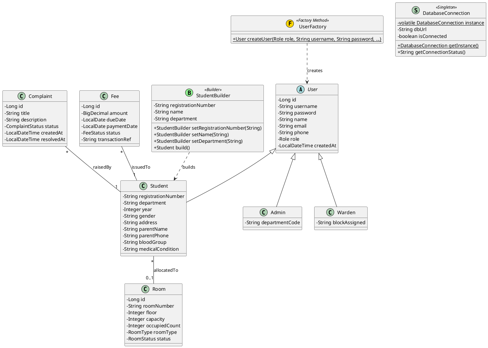
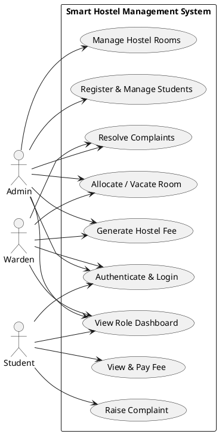
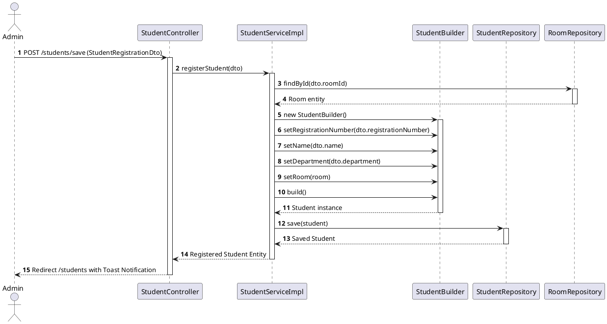
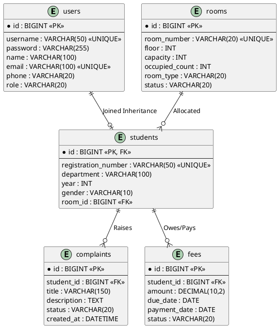

# Smart Hostel Management System

An enterprise-level web application built with **Java 21**, **Spring Boot 3.x**, **Spring Data JPA**, **Spring Security**, and **Thymeleaf** to demonstrate the implementation of **Gang of Four (GoF) Design Patterns** for a University Design Patterns course.

---

## Table of Contents
1. [Project Overview](#project-overview)
2. [Tech Stack](#tech-stack)
3. [Gang of Four (GoF) Design Patterns](#gang-of-four-gof-design-patterns)
4. [Database Setup & MySQL Schema](#database-setup--mysql-schema)
5. [Setup & Execution Instructions](#setup--execution-instructions)
6. [Pre-seeded Demo User Accounts](#pre-seeded-demo-user-accounts)
7. [System Diagrams (PlantUML)](#system-diagrams-plantuml)
   - [UML Class Diagram](#1-uml-class-diagram)
   - [Use Case Diagram](#2-use-case-diagram)
   - [Sequence Diagram](#3-sequence-diagram)
   - [Entity Relationship (ER) Diagram](#4-entity-relationship-er-diagram)

---

## Project Overview

The **Smart Hostel Management System** automates key administrative and operational workflows in university residential halls, including:
- **Dashboard Analytics**: Real-time counter metrics for total/occupied/available rooms, student enrollment, pending complaints, and fee dues.
- **Student Management (CRUD)**: Complete profile tracking (Reg Number, Department, Year, Gender, Medical Conditions, Room Allocation).
- **Room Management (CRUD)**: Capacity tracking, floor layouts, room types (Single, Double, Triple, Deluxe), and automated status updates (Available, Full, Maintenance).
- **Complaint Management**: Student complaint submission and Admin/Warden resolution workflows.
- **Fee Management**: Hostel fee billing generation, payment gateway recording, and student fee payment history.

---

## Tech Stack

- **Backend**: Java 21, Spring Boot 3.2.5, Spring MVC, Spring Data JPA, Hibernate, Spring Security 6, Maven
- **Frontend**: Thymeleaf, HTML5, CSS3, Bootstrap 5.3, Bootstrap Icons, JavaScript
- **Database**: MySQL 8.0+ (`hostel_db`)
- **IDE**: IntelliJ IDEA / Eclipse / VS Code

---

## Gang of Four (GoF) Design Patterns

### 1. Singleton Pattern (`DatabaseConnection.java`)
- **Package**: `com.hostel.system.singleton`
- **Intent**: Ensures that a class has only one instance in the entire JVM lifecycle and provides a thread-safe global access point.
- **Why Used Here**: Managing physical database metadata and connection parameters is resource-heavy. Double-checked locking with `volatile` guarantees that only a single instance coordinates system diagnostics across multi-threaded Spring HTTP requests.

### 2. Factory Method Pattern (`UserFactory.java`)
- **Package**: `com.hostel.system.factory`
- **Intent**: Defines an interface/class for creating an object, but lets subclasses or factory methods decide which class to instantiate.
- **Why Used Here**: `User` is an abstract base entity with concrete subclasses `Student`, `Admin`, and `Warden`. `UserFactory.createUser(Role, ...)` encapsulates instantiation logic, avoiding direct `new Student()`, `new Admin()`, `new Warden()` calls across services.

### 3. Builder Pattern (`StudentBuilder.java`)
- **Package**: `com.hostel.system.builder`
- **Intent**: Separates the construction of a complex object from its representation so that the same construction process can create different representations.
- **Why Used Here**: `Student` objects contain 14+ mandatory and optional attributes (Reg Number, Dept, Year, Address, Parent Phone, Medical Condition, Room). `StudentBuilder` provides fluent method chaining (`setName().setDepartment().setEmail().build()`), eliminating telescoping constructors and parameter order mistakes.

---

## Database Setup & MySQL Schema

The database script is located at: `sql/hostel_db.sql`.

### Tables Created:
1. `rooms` (Hostel room details and capacity counts)
2. `users` (Base user authentication table using Joined Inheritance)
3. `admins` (Extends `users` table)
4. `wardens` (Extends `users` table)
5. `students` (Extends `users` table with room FK)
6. `complaints` (Student maintenance tickets)
7. `fees` (Hostel billing and payment records)

---

## Setup & Execution Instructions

### Prerequisites
1. **Java Development Kit (JDK 21)** installed and set in `PATH`.
2. **Apache Maven 3.8+** installed.
3. **MySQL Server 8.0+** running locally on port `3306`.

### Step 1: Create Database & Seed Script
Open your MySQL Workbench or Command Line and execute:
```sql
SOURCE /path/to/project/sql/hostel_db.sql;
```
*(Alternatively, Spring Boot automatic schema update will create the database automatically on first startup).*

### Step 2: Configure Database Credentials
Open `src/main/resources/application.properties` and update your MySQL credentials:
```properties
spring.datasource.url=jdbc:mysql://localhost:3306/hostel_db?createDatabaseIfNotExist=true&useSSL=false
spring.datasource.username=root
spring.datasource.password=your_mysql_password
```

### Step 3: Build & Run Application
Execute via terminal in project root directory:
```bash
mvn clean package
mvn spring-boot:run
```

Access the application in your browser at:  
👉 `http://localhost:8080`

---

## Pre-seeded Demo User Accounts

| Role | Username | Password | Access Level |
|---|---|---|---|
| **Admin** | `admin` | `admin123` | Full System Access (All Modules, User/Room/Fee CRUD) |
| **Warden** | `warden` | `warden123` | Student View, Room Status, Complaint Resolution, Fee Overview |
| **Student** | `student1` | `student123` | Personal Dashboard, File Complaints, Pay Hostel Fees |

---

## System Diagrams (PlantUML)

### 1. UML Class Diagram


---

### 2. Use Case Diagram


---

### 3. Sequence Diagram
*(Student Registration Flow via StudentBuilder Pattern)*



---

### 4. Entity Relationship (ER) Diagram

# Design-Pattern-Project

